# 1. Google Dialogflow Agent
## 1.1. Dialogflow agent 생성
	- Dialogflow agnet: user와의 대화를 처리하는 가상 에이전트. 인간의 언어를 이해하는 자연어 이해 모듈.
	- Make-Bike-Assignment라는 이름으로 Agent 생성
	- 자전거 수리점의 챗봇을 만든다고 가정하여, 운영시간을 표시하고 예약을 설정하는 챗봇을 제작한다
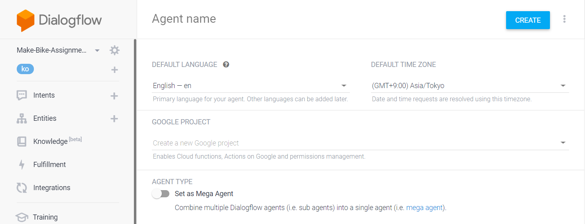
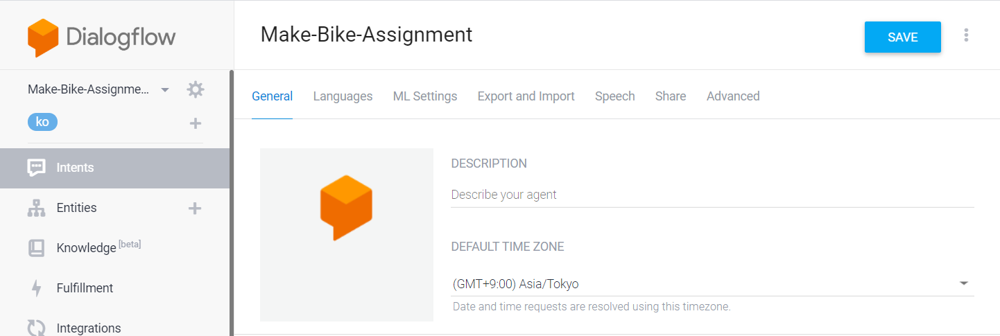

## 1.2. 기본 Intent
	- 처음 Agent를 생성하면 기본적으로 설정되어 있는 Intent가 2 개 존재한다.
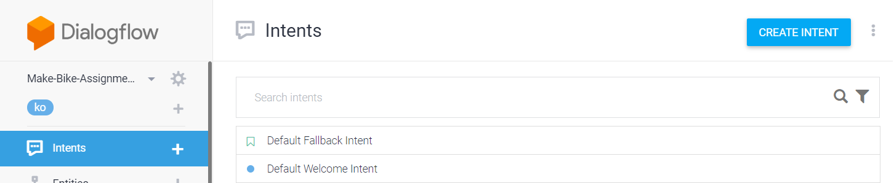
#### 1.2.1. Default fallback Intent
- User가 입력한 메시지를 Dialogflow가 인식하지 못했을 때 실행되는 Intent.
- 보통 User의 재입력을 바라는 응답을 보낸다. 
- 기존 응답을 수정하고 3개의 응답 추가 후 SAVE


#### 1.2.2. Default Welcome Intent
	- User가 인사하면 인사말을 건네는 Intent.
  - 기존에 설정된 Training phrases에 몇 가지 요소를 추가하였다(보통 training phrases는 10개 이상으로 하는 것이 좋다).
  - 기존 응답을 수정하여 3개의 유저 응답을 유도하는 응답을 추가 후 SAVE.
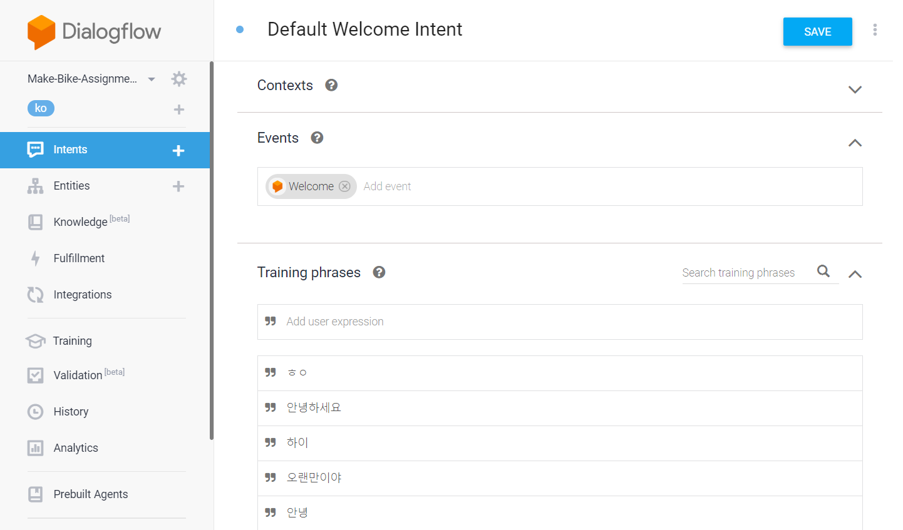
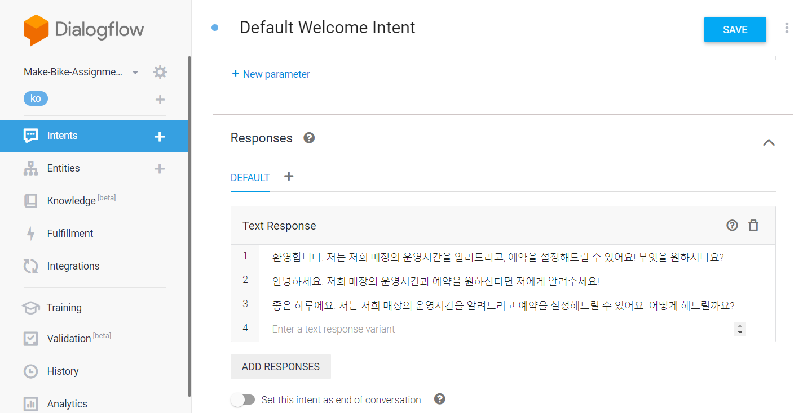

## 1.3. Custom Intent 추가
#### 1.3.1. Hours Intent
	- Default Intent들과 마찬가지고 User의 예상 Input과 챗봇이 대답해야할 응답을 설정해준다.
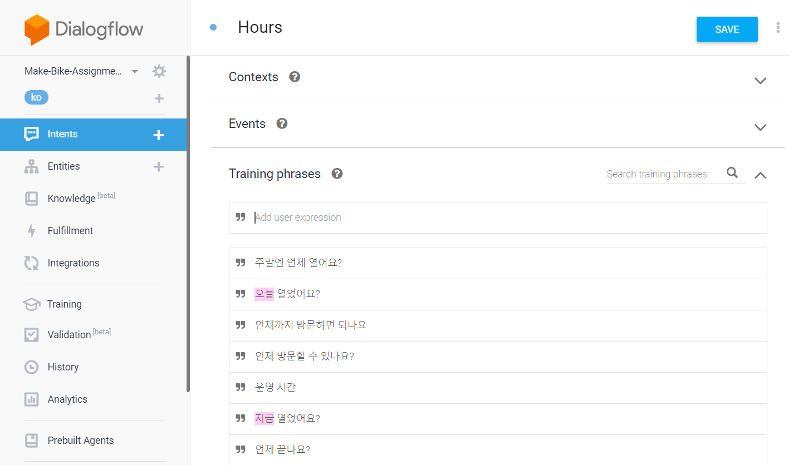
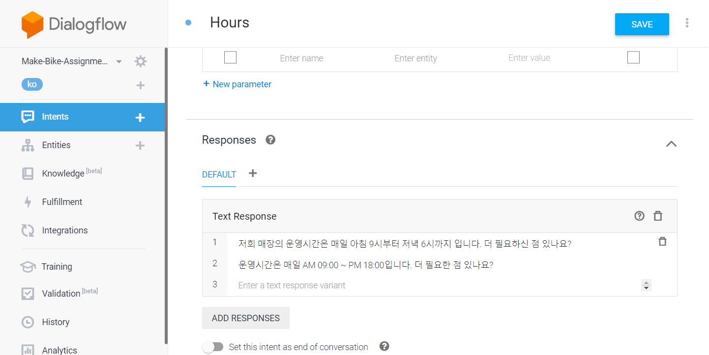

	- 여기서 User가 입력한 Input에서 '언제'에 해당하는 값을 인식해야 하기 때문에 action and parameters에서 매개변수를 설정한다.
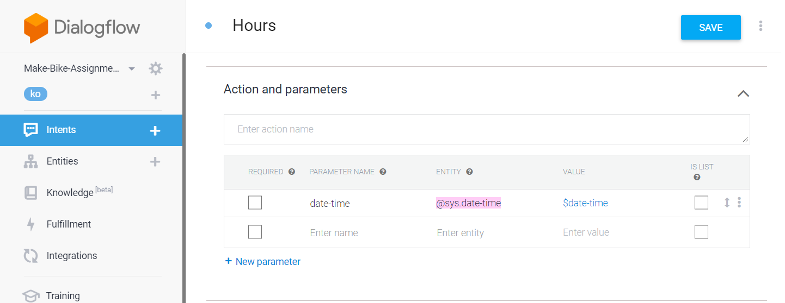

	- 매개변수는 training phrases를 입력할 때 시스템에서 기본적으로 제공하는 parameter들은 자동으로 인식을 하며, 의도와 맞지 않을 경우에는 해제하고 custom하여 설정할 수 있다.
<hr/>

#### 1.3.2. Make Appointment Intent
	- 위에서와 마찬가지로 User의 예상 Input과 응답을 추가해준다.
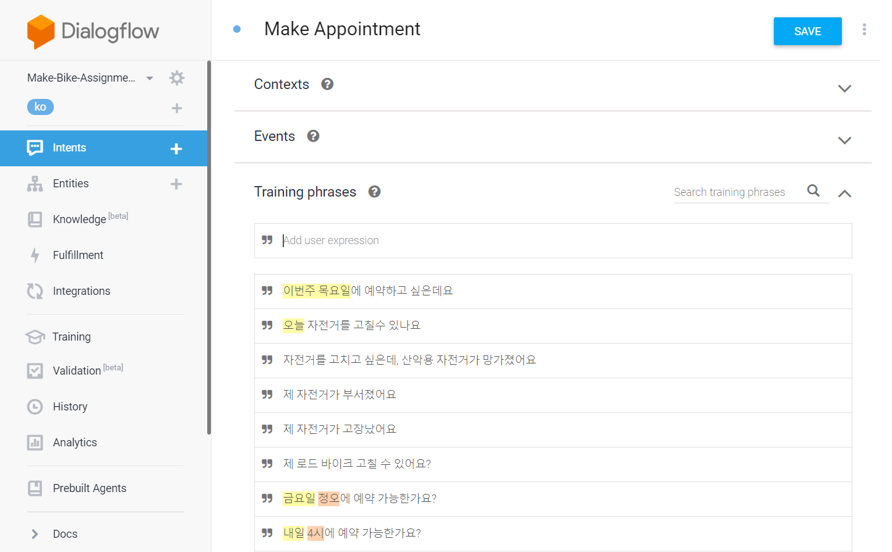
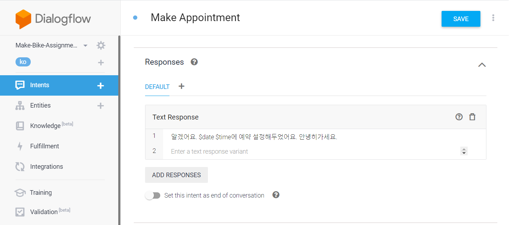
	- 여기서는 '어떤 날짜'와 '몇 시'라는 parameter를 입력받아야 한다. 따라서 date와 time을 나누어 parameter로 설정하여 받도록 하였다.
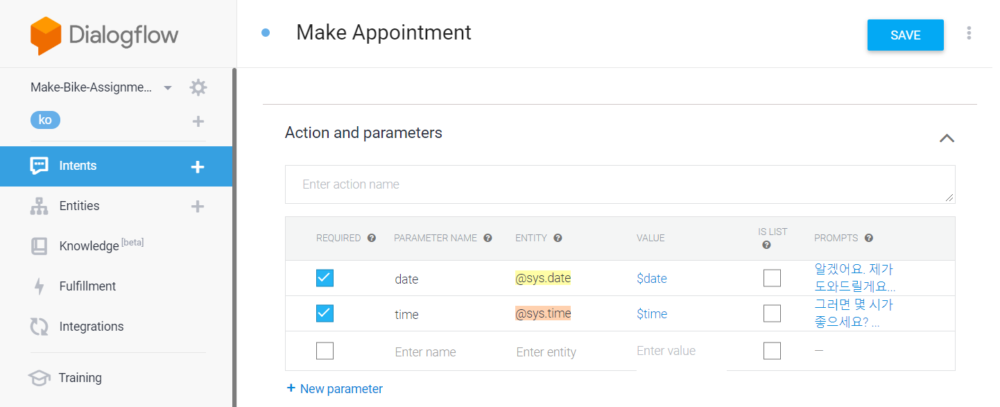
	- 예약을 하기 위해서는 날짜와 시간이 필수적이다. 따라서 action 탭에서 설정한 parameter 가장 왼쪽의 required 체크박스를 체크하면 해당 항목을 무조건 입력이 되어야 하는 항목이 된다.
	- 이 때 각 항목을 입력하지 않으면 입력하도록 유도하는 Prompt라는 것을 사용할 수 있으며, prompt는 변수의 위, 아래 순서대로 적용된다(ex. 여기서는 date가 위에 있으므로 날짜에 대한 질문이 먼저 나옴).
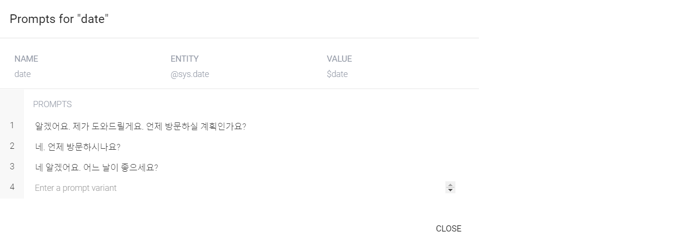

## 1.4. Inline editor를 통한 fulfillment
	- 위에서 생성한 챗봇 Agent를 배포하는 것에는 크게 2가지 방법이 있는데, 그 중 간단하게 dialogflow console에 내장되어 있는 inline editor를 통해 agent를 배포하는 방법이다.<br>
	- 이 방법은 Firebase의 Cloud function을 이용하여 Serverless로 동작한다.<br>
	- fulfillment하기 위해서 미리 만들어 두었던 Intent의 fulfillment를 허용해준다.<br>
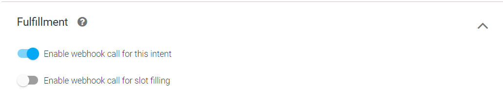
	- 이후 fulfillment 탭의 inline editor에서 package.json과 index.js를 다음과 같이 수정한다.
```json
{
  "name": "DialogflowFirebaseWebhook",
  "description": "Firebase Webhook dependencies for a Dialogflow agent.",
  "version": "0.0.1",
  "private": true,
  "license": "Apache Version 2.0",
  "author": "Google Inc.",
  "engines": {
    "node": "6"
  },
  "scripts": {
    "lint": "semistandard --fix \"**/*.js\"",
    "start": "firebase deploy --only functions",
    "deploy": "firebase deploy --only functions"
  },
  "dependencies": {
    "firebase-functions": "^2.0.2",
    "firebase-admin": "^5.13.1",
    "googleapis": "^27.0.0",
    "actions-on-google": "2.2.0",
    "dialogflow-fulfillment": "0.5.0"
  }
} -> package.json
```
```javascript
/**
 * Copyright 2017 Google Inc. All Rights Reserved.
 *
 * Licensed under the Apache License, Version 2.0 (the "License");
 * you may not use this file except in compliance with the License.
 * You may obtain a copy of the License at
 *
 *      http://www.apache.org/licenses/LICENSE-2.0
 *
 * Unless required by applicable law or agreed to in writing, software
 * distributed under the License is distributed on an "AS IS" BASIS,
 * WITHOUT WARRANTIES OR CONDITIONS OF ANY KIND, either express or implied.
 * See the License for the specific language governing permissions and
 * limitations under the License.
 */

'use strict';

const functions = require('firebase-functions');
const {google} = require('googleapis');
const {WebhookClient} = require('dialogflow-fulfillment');

// Enter your calendar ID and service account JSON below.
const calendarId = 'ajou.ac.kr_d2b72m0u754jgnok8qqh7v7cvc@group.calendar.google.com'; // Example: 6ujc6j6rgfk02cp02vg6h38cs0@group.calendar.google.com
const serviceAccount = {
  "type": "service_account",
  "project_id": "make-bike-assignment-**",
  "private_key_id": "--",
  "private_key": "--",
  "client_email": "--",
  "client_id": "--",
  "auth_uri": "https://accounts.google.com/o/oauth2/auth",
  "token_uri": "https://oauth2.googleapis.com/token",
  "auth_provider_x509_cert_url": "https://www.googleapis.com/oauth2/v1/certs",
  "client_x509_cert_url": "https://www.googleapis.com/robot/v1/metadata/x509/bike-shop-calendar%40make-bike-assignment-reopsi.iam.gserviceaccount.com"
}; // The JSON object looks like: { "type": "service_account", ... }

// Set up Google Calendar service account credentials
const serviceAccountAuth = new google.auth.JWT({
  email: serviceAccount.client_email,
  key: serviceAccount.private_key,
  scopes: 'https://www.googleapis.com/auth/calendar'
});

const calendar = google.calendar('v3');
process.env.DEBUG = 'dialogflow:*'; // It enables lib debugging statements

const timeZone = 'Asia/Tokyo';  // Change it to your time zone
const timeZoneOffset = '+09:00';         // Change it to your time zone offset

exports.dialogflowFirebaseFulfillment = functions.https.onRequest((request, response) => {
  const agent = new WebhookClient({ request, response });

  function makeAppointment (agent) {
    // Use the Dialogflow's date and time parameters to create Javascript Date instances, 'dateTimeStart' and 'dateTimeEnd',
    // which are used to specify the appointment's time.
    const appointmentDuration = 1;// Define the length of the appointment to be one hour.
    const dateTimeStart = convertParametersDate(agent.parameters.date, agent.parameters.time);
    const dateTimeEnd = addHours(dateTimeStart, appointmentDuration);
    const appointmentTimeString = getLocaleTimeString(dateTimeStart);
    const appointmentDateString = getLocaleDateString(dateTimeStart);
    // Check the availability of the time slot and set up an appointment if the time slot is available on the calendar
    return createCalendarEvent(dateTimeStart, dateTimeEnd).then(() => {
      agent.add(`알겠어요. ${appointmentDateString}, ${appointmentTimeString}시에 예약 완료했어요. 안녕히 가세요.`);
    }).catch(() => {
      agent.add(`죄송해요, ${appointmentDateString}, ${appointmentTimeString}시에 이미 예약이 있어요. 그 밖에 도와드릴 일이 있을까요?`);
    });
  }
  let intentMap = new Map();
  intentMap.set('Make Appointment', makeAppointment);  // It maps the intent 'Make Appointment' to the function 'makeAppointment()'
  agent.handleRequest(intentMap);
});

function createCalendarEvent (dateTimeStart, dateTimeEnd) {
  return new Promise((resolve, reject) => {
    calendar.events.list({  // List all events in the specified time period
      auth: serviceAccountAuth,
      calendarId: calendarId,
      timeMin: dateTimeStart.toISOString(),
      timeMax: dateTimeEnd.toISOString()
    }, (err, calendarResponse) => {
      // Check if there exists any event on the calendar given the specified the time period
      if (err || calendarResponse.data.items.length > 0) {
        reject(err || new Error('Requested time conflicts with another appointment'));
      } else {
        // Create an event for the requested time period
        calendar.events.insert({ auth: serviceAccountAuth,
          calendarId: calendarId,
          resource: {summary: 'Bike Appointment',
            start: {dateTime: dateTimeStart},
            end: {dateTime: dateTimeEnd}}
        }, (err, event) => {
          err ? reject(err) : resolve(event);
        }
        );
      }
    });
  });
}

// A helper function that receives Dialogflow's 'date' and 'time' parameters and creates a Date instance.
function convertParametersDate(date, time){
  return new Date(Date.parse(date.split('T')[0] + 'T' + time.split('T')[1].split('+')[0] + timeZoneOffset));
}

// A helper function that adds the integer value of 'hoursToAdd' to the Date instance 'dateObj' and returns a new Data instance.
function addHours(dateObj, hoursToAdd){
  return new Date(new Date(dateObj).setHours(dateObj.getHours() + hoursToAdd));
}

// A helper function that converts the Date instance 'dateObj' into a string that represents this time in English.
function getLocaleTimeString(dateObj){
  return dateObj.toLocaleTimeString('en-US', { hour: 'numeric', hour12: true, timeZone: timeZone });
}

// A helper function that converts the Date instance 'dateObj' into a string that represents this date in English.
function getLocaleDateString(dateObj){
  return dateObj.toLocaleDateString('en-US', { weekday: 'long', month: 'long', day: 'numeric', timeZone: timeZone });
} -> index.js
```

	- 위 index.js는 참고한 예제에서 calendarID, serviceAccount, timezone, timezoneOffset, agent.add의 내용 일부, convertParametersDate의 일부만을 환경에 맞게 변형하였다.

<hr/>
- 이후 Google Dialogflow에서 기본으로 제공되는 google assistant를 이용하여 테스트 해보면 실제 구글 캘린더에 일정이 등록되는 것을 볼 수 있다.
- 참고 소스코드(구글 공식문서): https://cloud.google.com/dialogflow/docs/tutorials/build-an-agent/create-fulfillment-using-webhook

# 2. connect dialogflow agent with Vue chatting UI
## 2.1. Webhook
	- Dialogflow를 사용하게 되었던 원래 목적은 기존에 Vue를 사용하여 구현해뒀던 Chatting UI와의 연동을 위해서였다.
	- 따라서 Inline editor가 아닌 기존의 채팅 서버에 dialogflow를 접목하여 챗봇 메시지를 UI에 띄워주는 방식을 사용해야 했다.

## 2.2. 구현 과정
#### 2.2.1. Webhook 사용 설정: fulfillment 창에 들어가서 Webhook을 enable 해준다.
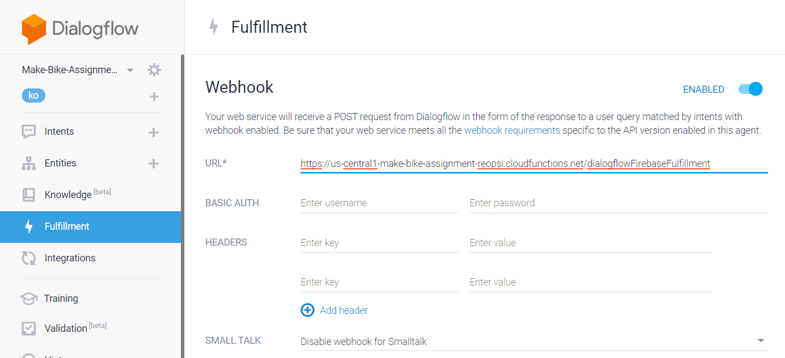

#### 2.2.2. 서비스 계정 키 생성: GCP로 접속하여 보안 키를 json형식으로 생성한다.
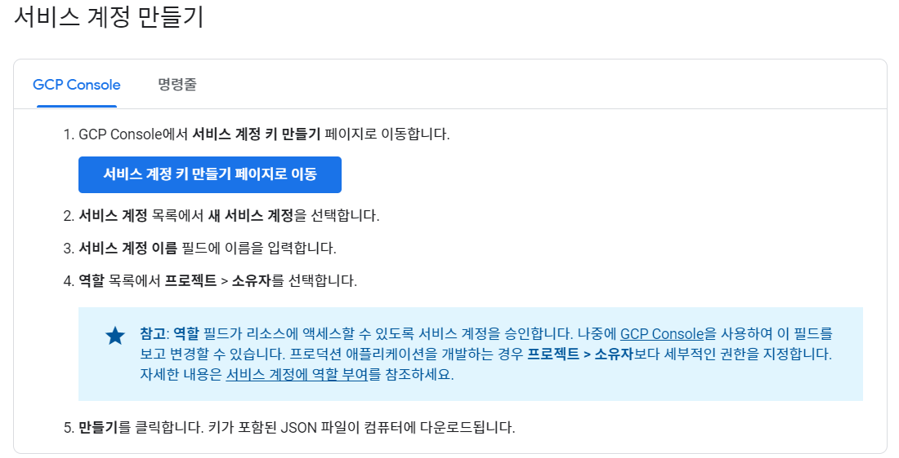

#### 2.2.3. 환경 변수 설정: 위 과정을 통해 다운받은 보안 키를 환경 변수에 등록한다.
	-> **이 과정은 세션이 종료되면 다시 실행해야 한다** (터미널 다시 켜면 다시 해줘야 함)

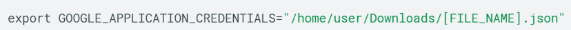
<br>

#### 2.2.4. 기존 서버 코드에 dialogflow call 부분 통합

- 4.1. Dialogflow에 요청을 보내려면 PorjectId와 SessionID가 필요하므로 미리 변수로 선언한다. ProjectID는 Dialogflow의 setting탭에 들어가면 바로 확인할 수 있고, SessionID는 Socket별로 session을 줄것이므로 socket의 id를 사용하였다.
```javascript
const projectId = 'make-bike-assignment-reopsi';
const sessionId = socket.id; //io.on('connection') 내부

```

- 4.2. 기존 코드에서 socket connection이 시작되면 session이 시작되도록 io.on('connection') 내부에서 sessionClient와 sessionPath를 선언한다.
```javascript
const sessionClient = new dialogflow.SessionsClient();
const sessionPath = sessionClient.sessionPath(projectId, sessionId);
```

- 4.3. Dialogflow에 요청하기 위해서는 정해진 request 틀이 있으므로 해당 틀을 생성한다.
```javascript
function makeRequest(sessionPath, message){
    return {
        session: sessionPath,
        queryInput: {
            text: {
              text: message,
              languageCode: 'ko',
            },
          },
    }
}

const query = makeRequest(sessionPath, data.msg);
```

- 4.4. 미리 생성한 sessionClient를 통해 Dialogflow에 요청을 전달한다. Node js는 기본적으로 비동기 동작하지만 여기서는 Dialogflow에서 응답이 돌아온 뒤에 logic이 수행되며 하므로 async function으로 함수를 생성한다. 반환값도 await로 기다렸다가 return.
```javascript
async function getResponse(sessionClient, request){
    const responses = await sessionClient.detectIntent(request);
    return await responses[0].queryResult;
}
```

- 4.5. Dialogflow에서 넘어온 응답을 User에게 전송해준다.
```javascript
getResponse(sessionClient, query)
        .then((result) => {
            console.log("response from chat-bot: ", result.fulfillmentText);
            io.to(user.room).emit('newMessage', {name:admin, msg: result.fulfillmentText});
        })
        .catch((err) => {
            console.log(err);
        });
```

<hr/>
- 참고 사이트: 구글 공식 사이트(인증): https://cloud.google.com/docs/authentication/getting-started<br>
- 참고 사이트: 테스트 코드(npm dialogflow 공식): https://www.npmjs.com/package/dialogflow#samples<br>
- 참고 사이트: async await: https://developers.google.com/web/fundamentals/primers/async-functions?hl=ko